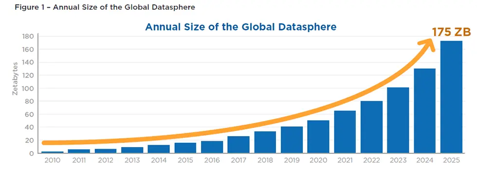
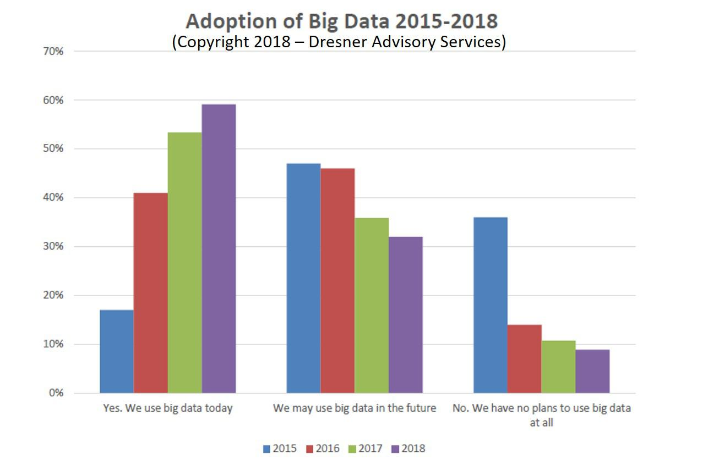

Data age 2025 by Seagate

A cada dois anos em média, os dados gerados dobram de tamanho. Então pensar se a arquitetura de dados é escalável é algo a ser pesado na construção do projeto. O importante não é apenas o armazenamento, mas o processamento, análise e disponibilidade desses dados.

- Facebook recebe 600 terabytes de dados por dia
- Youtube recebe 300 horas de vídeo por minuto
- Google recebe 40 mil consultas de pesquisa por segundo

Segundo uma pesquisa de 2018 da Dresner aponta que as empresas que usam tecnbologia big data saltou de 17% em 2015 para 59% em 2018. Em contra partida, o percentual das empresas que não planejam usar big data caiu de 36% em 2015 para 9% para 2018.

### 3V, 5V, 10V do Big Data

1. Volume: Grande volume de dados, petabytes, terabytes... (armazenamento, processamento e analise)
2. Velocidade: Velocidade de armazenar, processar e analisar rápido e escalável
3. Variedade: Diversos tipos de dados, estruturados, semi estruturados, não estruturados, diferentes formatos...
Camada de business 4. Veracidade: Quão confiável e precisa é aquela fonte dos dados
Camada de business 5. Valor: Entregar valor baseado em dados para o cliente
6. Variabilidade: Variação de velocidade que o dado chega
7. Validade: Que ferramentas usadas para avaliar a confiança dos dados, métricas para isso.
8. Vulnerabilidade: Como proteger seus dados, camada de segurança
9. Volatilidade: Tempo de vida útil dos dados
10. Visualização: Muito ligada ao valor, através das visualizações é possível transimitr o valor gerado através dos dados

### Qual arquitetura usar para essa volumetria que cresce todos os dias?

- Vertical: Mais memória, Mais HD, Mais CPU
- Horizontal: Mais computadores (cluster) para armazenar, processar e analisar. Essa arquitetura é conhecida como hadoop, aqui não precisamos do melhor hardware porque aumentamos a quantiade de computadores para fazer o trabalho, escalando de forma mais fácil e controlada quando preciso.