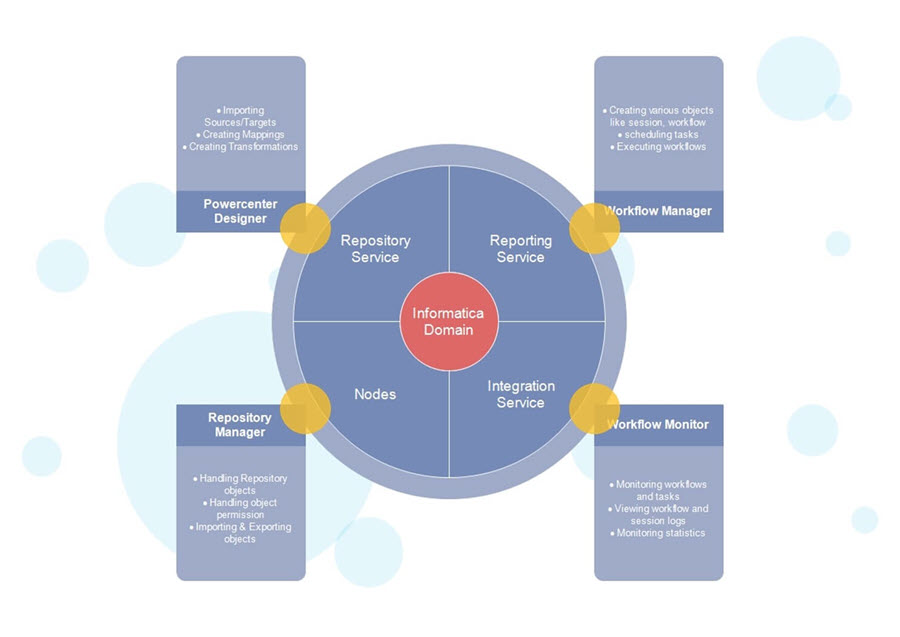

#### Informatica PowerCenter

ETL tool provided by Informatica, is used for Data integration, offers the capacbility to connect and fetch data from differente source and processing data.

Typical use cases:

* Migrating data from existing legacy system like mainframe to a new database sytem;
* Setting up data warehouse that require an ETL tool to move data from production system to warehouse;
* Integration of data from various heterogeneous system like multiple databases and file-based systems;
* For data cleansing tool;

Informatica offers real time data integration, web services integration, business to business data integration, bi data edition, master data management and connectors for social media and Salesforce.

#### Informatica PowerCenter Architecture

1. Repository Service: Responsible for maintaining Informatica metadata and providing access of saame to other services;
2. Integration Service: Responsible for the movement of data from sources to targets;
3. Reporting Service: Enables the generation of reports;
4. Nodes: Computing platform where the above services are executed;
5. Powercenter Designer: User for creation of mappings between source and target;
6. Workflow Manager: Used to create workflows and other task and their execution;
7. Workflow Monitor: Used to monitor the execution of workflows;
8. Repository Manager: Used to manage objects in repository

#### Informatica Domain

It is a collection of nodes and services that can be categorized into folders and sub-folders based on the administration requirement.

Node is a logical representation of a machine insede the domain, Node is required to run services and processes for Informatica. You can have multiple node in a domain.

In a domain, you will also find a gateway node, that is responsible for receiving requests from different client tools and routing those requests to different nodes and services.

There are two types of services in Domain:

* Service manager: Maanages authentication, aauthorization and logging. Also runs application services on the nodes as well as manages users and groups;
* Application services: Represents the server specific like integration service, repository service and reporting service, these services run on differente nodes based upon the configuration

#### Informatica PowerCenter Repository

Is a Relational Database, like Oracle, Sybase, SQL Server and it is managed by repository service, tht consists of dtabase tables that stores metadata.

There are three Informatica Client tools availaable:

1. Designer
2. Workflow Monitor
3. Workflow Manager

These clientes can access to the repository using repository service only.

A single repository service handles only one repository. Also, a repository service can execute on multiple nodes to increase the performance.

The repository service use locks on the objects, so multiple users cannot modify the same object same time. You can enable version control in the repository.

Objects created in the repository can have three state:

* Valid: Syntax is correct according to Informatica, can be used in the execution of workflows;
* Invalid: Those who does not adhere to the standard or rules specified.
* Impacted: Those whose child objects are invalid.

The mappings and objects that we create in these cliente tools are saved in the informatica repository which resides on the informatica server. So the cliente tools must have network connectivity to the server. PowerCenter client tools must have connectivity to the source/target systems

* To connect to the integration service and repository service, PowerCenter client uses TCP/IP protocols and
* To connect to the sources/targets PowerCenter client uses ODBC drivers.

#### Repository Service

Maintains the connections from PowerCenter clients to the PowerCenter repository. It is a separate multi-threaaded process, and it fetches, inserts and updates the metadata inside the repository, also responsible for maintaining consistency inside the repository metadata.

#### Integration Service

Is the executing engine for the Informatica, this is the entity which executes the tasks that we create in Informatica. This is how it works:

-  A user executes a workflow    
-   Informatica instructs the integration service to execute the workflow    
-   The integration service reads workflow details from the repository 
-   Integration service starts execution of the tasks inside the workflow    
-   Once execution is complete, the status of the task is updated i.e. failed, succeeded or aborted.    
-   After completion of execution, session log and workflow log is generated.    
-   This service is responsible for loading data into the target systems 
-   The integration service also combines data from different sources

So, in summary, Informatica integration service is a process residing on the Informatica server waiting for tasks to be assigned for the execution. When we execute a workflow, the integration service receives a notification to execute the workflow. Then the integration service reads the workflow to know the details like which tasks it has to execute like mappings & at what timings. Then the service reads the task details from the repository and proceeds with the execution.

#### Source Definition

Is an entity from where you pull the records, and then you store these records in temporary tables (staging tables) or Informatica transformation caches. Mapping design make a change in these data records and then load the transformed data in another tables structures, called target tables. In every Informatica mapping, there will always be a source and a target. To manager different sources and targets in Informatica, you have to use source analyzer and target designer.

The source or target created/imported in Informatica can be reused any no of times in different mappings. Every mapping must have at least on loadable target. Otherwise mapping will be invalid. 

**Performance tip** – To improve the performance of Relational Source tables, use indexes on the source database tables. On the target, tables disable or remove constraints and indexes for performance.

