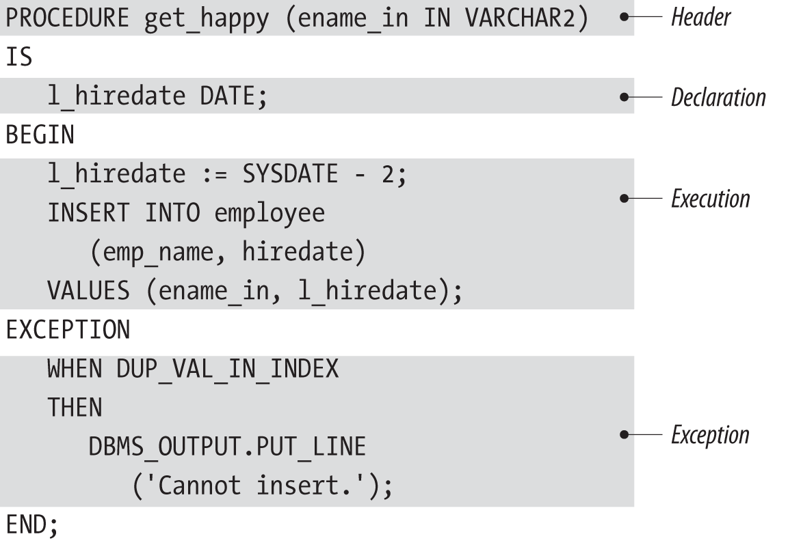
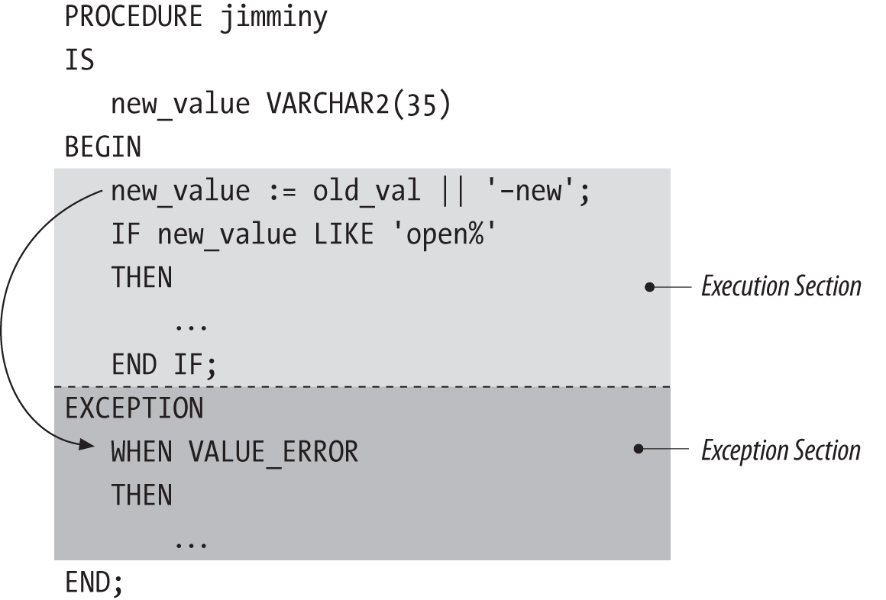
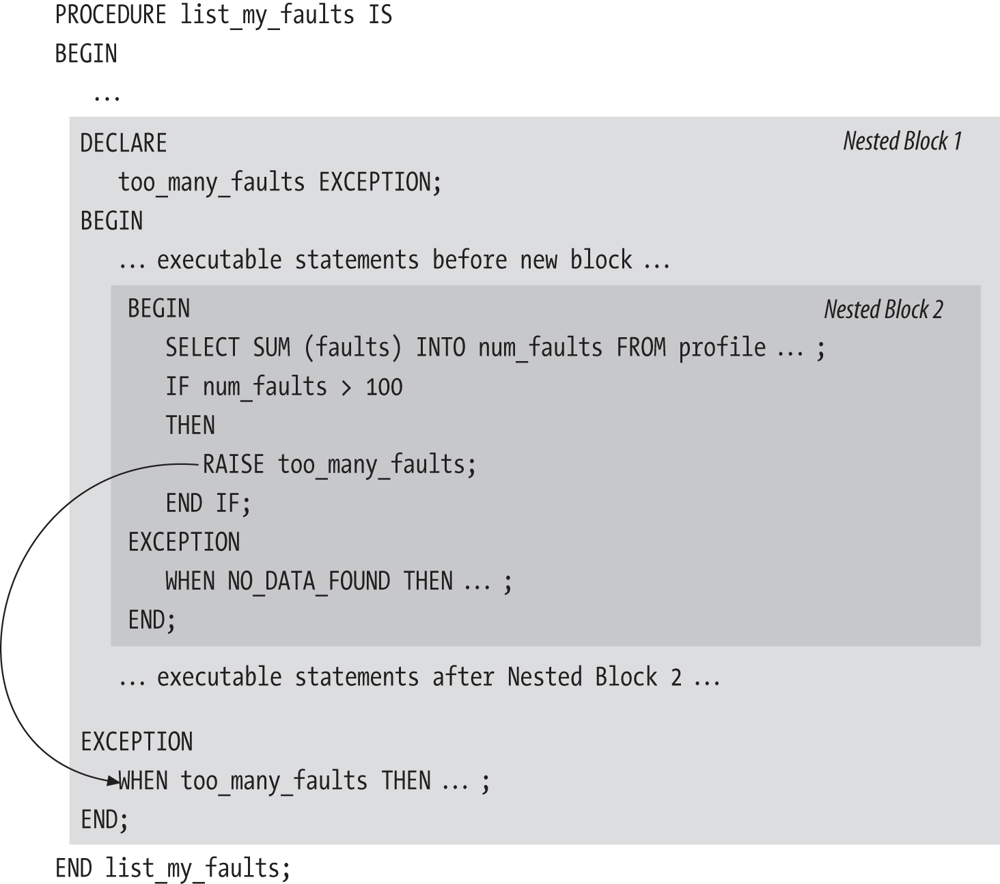
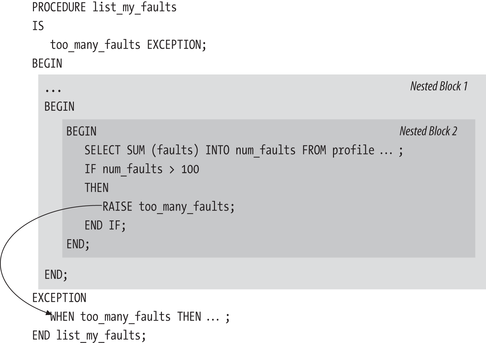

#### Examples of PL/SQL Statements

```sql
DECLARE
	in_books_count number;

BEGIN
	SELECT COUNT(*)
	INTO in_books_count
	FROM books
	WHERE author LIKE '%FEURSTEIN, STEVEN%';
	
	DBMS_OUTPUT.PUT_LINE(
		'Steven has written (or co-written)' ||
		in_books_count || ' books.'
	);
	
	-- Oh, and i changed my name, so...
	
	UPDATE books
		SET author = REPLACE(author, 'STEVEN', 'STEPHEN')
		WHERE author LIKE '%FEURSTEIN, STEVEN%';		
END;

-- Example of Procedure

PROCEDURE pay_out_balance (
	account_id_in IN accounts.id%TYPE)
IS
	l_balance_remaining NUMBER;
BEGIN
	LOOP
		l_balance_remaining := account_balance (account_id_in);

 		IF l_balance_remaining < 1000
 		THEN
 			EXIT;
 		ELSE
 			apply_balance (account_id_in, l_balance_remaining);
 		END IF;
 	END LOOP;
 END pay_out_balance;
 
 
-- Procedure with raise and handling errors
 
PROCEDURE check_account (
	account_id_in IN accounts.id%TYPE)
IS
	l_balance_remaining NUMBER;
	l_balance_below_minimum EXCEPTION;
	l_account_name accounts.name%TYPE;
BEGIN
	SELECT name
	INTO l_account_name
	FROM accounts
	WHERE id = account_id_in;

	l_balance_remaining := account_balance (account_id_in);

	DBMS_OUTPUT.PUT_LINE (
		'Balance for ' || l_account_name ||
		' = ' || l_balance_remaining
	);

	IF l_balance_remaining < 1000
	THEN
		RAISE l_balance_below_minimum;
	END IF;

EXCEPTION
	WHEN NO_DATA_FOUND
	THEN
		-- No account found for this ID
		log_error (...);
		RAISE;
	WHEN l_balance_below_minimum
	THEN
		log_error (...);
		RAISE VALUE_ERROR;
END;
	
```

#### Advices

- Construct test cases and test scripts before you write your code;
- Establish clear rules for how developers will write the SQL statements in application;
- Data encapsulation for be easily optimized, tested and maintained;
- Establish clear rules for hoe developers will handle exceptions in the application (Single error-handling package)
- Use top-down design (a.k.a stepwise refinement) to limit the complexity of the requirements you must deal with at any given time;
- Reward admissions of ignorance, develop a culture tha welcomes questions and requests for help;
- If you cannot figure out the source of a bug in 30 minutes, ask for help;
- Set up a formal peer code review process, don't let any code go to QA or production without being read and critiqued (in a positive, constructive manner);
- Take a creative approach, don't complain about your project/stack, be a solver problem person;


```sql
-- Example of word Count

CREATE OR REPLACE FUNCTION wordcount (str IN VARCHAR2)
	RETURN PLS_INTEGER
AS
	declare local variables here
BEGIN
	implement algorithm here
END;
/ -- runnin from SQL*PLUS, requires / at the end

SHOW ERRORS


/* 
You can also invoke many PL/SQL functions inside SQL statements. 
Here are several examples of how you can use the wordcount function: 

Apply the function in a select list to compute the number of words in a table column: 
*/

SELECT isbn, wordcount(description) FROM books;

/* 
Use the ANSI-compliant CALL statement, binding the function output to a
SQL*Plus variable, and display the result: 
*/

VARIABLE words NUMBER
CALL wordcount('some text') INTO :words;
PRINT :words

/* 
Same as above, but execute the function from a remote 
database as defined in the database link test.newyork.ora.com. 
*/

CALL wordcount@test.newyork.ora.com('some text') INTO :words;

/* 
Execute the function, owned by schema bob, while logged in to any schema that
has appropriate authorization: 
*/

SELECT bob.wordcount(description) FROM books WHERE id = 10007;

/* 
For example, to see a complete list of your programs 
(and tables, indexes, etc.), query the USER_OBJECTS view, as in: 
*/

SELECT * FROM USER_OBJECTS;

-- To give another user the authority to execute your program, issue a GRANT statement:

GRANT EXECUTE ON wordcount TO scott;

-- To remove the privilege, use REVOKE:

REVOKE EXECUTE ON wordcount FROM scott;

-- You could also grant the EXECUTE privilege to a role:

GRANT EXECUTE ON wordcount TO all_mis;

-- Or, if appropriate, you could allow any user on the current database to run the program:

GRANT EXECUTE ON wordcount TO PUBLIC;

/*
To view a list of privileges you have granted to other 
users and roles, you can query the USER_TAB_PRIVS_MADE data dictionary view.
Somewhat counterintuitively, PL/SQL program names appear in the table_name column:
*/

SELECT table_name, grantee, privilege
FROM USER_TAB_PRIVS_MADE
WHERE table_name = 'WORDCOUNT';
```


```sql
PROCEDURE remove_order (order_id IN NUMBER)
IS
BEGIN
	DELETE orders WHERE order_id = remove_order.order_id;
END;

DECLARE
	"pi" CONSTANT NUMBER := 3.141592654;
	"PI" CONSTANT NUMBER := 3.14159265358979323846;
	"2 pi" CONSTANT NUMBER := 2 * "pi";
BEGIN
	DBMS_OUTPUT.PUT_LINE('pi: ' || "pi");
	DBMS_OUTPUT.PUT_LINE('PI: ' || pi);
	DBMS_OUTPUT.PUT_LINE('2 pi: ' || "2 pi");
END;
/
/*
pi: 3.141592654
PI: 3.14159265358979323846
2 pi: 6.283185308
*/


<<outerblock>>
DECLARE
	counter INTEGER := 0;
BEGIN
	...
	DECLARE
		counter INTEGER := 1;
	BEGIN
		IF counter = outerblock.counter
		THEN
			...
		END IF;
	END;
END;


BEGIN
	<<outer_loop>>
	LOOP
		LOOP
			EXIT outer_loop;
		END LOOP;
		some_statement;
	END LOOP;
END;
```

#### Conditional and Sequential Control

```sql
IF condition
THEN
	... sequence of executable statements ...
END IF;


IF salary > 40000 OR salary IS NULL
THEN
	give_bonus (employee_id,500);
END IF;
```

Using operators such as IS NULL and IS NOT NULL or functions such as COALESCE and NVL2 are good ways to detect and deal with potentially NULL values. For every variable that you reference in every Boolean expression that you write, be sure to think carefully about the consequences if that variable is NULL.

```sql
IF salary > 40000
THEN
	INSERT INTO employee_bonus
		(eb_employee_id, eb_bonus_amt)
		VALUES (employee_id, 500);
	UPDATE emp_employee
	SET emp_bonus_given=1
	WHERE emp_employee_id=employee_id;
END IF;


IF NVL(salary,0) <= 40000
THEN
	give_bonus (employee_id, 0);
ELSE
	give_bonus (employee_id, 500);
END IF;
```

The NVL function will return zero any time salary is NULL, ensuring that any employees with a NULL salary also get a zero bonus (those poor employees).

```sql
order_exceeds_balance
	:= :customer.order_total > max_allowable_order;

/* 
Now, whenever you need to test whether an
order’s total exceeds the maximum, you can
write the following easily understandable IF statement:
*/

IF order_exceeds_balance
THEN
...


IF salary BETWEEN 10000 AND 20000
THEN
	give_bonus(employee_id, 1500);
ELSIF salary BETWEEN 20000 AND 40000
THEN
	give_bonus(employee_id, 1000);
ELSIF salary > 40000
THEN
	give_bonus(employee_id, 500);
ELSE
	give_bonus(employee_id, 0);
END IF;

-- a better way to do:

IF salary >= 10000 AND salary <= 20000
THEN
	give_bonus(employee_id, 1500);
ELSIF salary > 20000 AND salary <= 40000
THEN
	give_bonus(employee_id, 1000);
ELSIF salary > 40000
THEN
	give_bonus(employee_id, 400);
END IF;
```

#### Case statements

```sql
CASE employee_type
WHEN 'S' THEN
	award_salary_bonus(employee_id);
WHEN 'H' THEN
	award_hourly_bonus(employee_id);
WHEN 'C' THEN
	award_commissioned_bonus(employee_id);
ELSE
	RAISE invalid_employee_type;
END CASE;

/*
This CASE statement has an explicit ELSE clause; however, the ELSE is optional. When
you do not explicitly specify an ELSE clause of your own, PL/SQL implicitly uses the
following:
*/
ELSE
	RAISE CASE_NOT_FOUND;
	
/*
A searched CASE statement is a perfect fit for the problem of implementing the bonus
logic. For example:
*/

CASE
WHEN salary >= 10000 AND salary <=20000 THEN
	give_bonus(employee_id, 1500);
WHEN salary > 20000 AND salary <= 40000 THEN
	give_bonus(employee_id, 1000);
WHEN salary > 40000 THEN
	give_bonus(employee_id, 500);
ELSE
	give_bonus(employee_id, 0);
END CASE;

```

#### Case Expressions

CASE expressions take the following two forms:

```sql
Simple_Case_Expression :=
	CASE expression
	WHEN result1 THEN
		result_expression1
	WHEN result2 THEN
		result_expression2
	...
	ELSE
		result_expression_else
	END;
	
Searched_Case_Expression :=
	CASE
	WHEN expression1 THEN
		result_expression1
	WHEN expression2 THEN
		result_expression2
	...
	ELSE
		result_expression_else
	END;

```

Following is an example of a simple CASE expression being used with the DBMS_OUTPUT
package to output the value of a Boolean variable. (Recall that the PUT_LINE
program is not overloaded to handle Boolean types.) In this example, the CASE expression
converts the Boolean value into a character string, which PUT_LINE can then
handle:

```sql
DECLARE
	boolean_true BOOLEAN := TRUE;
	boolean_false BOOLEAN := FALSE;
	boolean_null BOOLEAN;
	FUNCTION boolean_to_varchar2 (flag IN BOOLEAN) RETURN VARCHAR2 IS
	BEGIN
		RETURN
			CASE flag
				WHEN TRUE THEN 'True'
				WHEN FALSE THEN 'False'
				ELSE 'NULL'
			END;
	END;
BEGIN
	DBMS_OUTPUT.PUT_LINE(boolean_to_varchar2(boolean_true));
	DBMS_OUTPUT.PUT_LINE(boolean_to_varchar2(boolean_false));
	DBMS_OUTPUT.PUT_LINE(boolean_to_varchar2(boolean_null));
END;

```

A searched CASE expression can be used to implement my bonus logic, returning the
proper bonus value for any given salary:

```sql
DECLARE
	salary NUMBER := 20000;
	employee_id NUMBER := 36325;
	PROCEDURE give_bonus (emp_id IN NUMBER, bonus_amt IN NUMBER) IS
	BEGIN
		DBMS_OUTPUT.PUT_LINE(emp_id);
		DBMS_OUTPUT.PUT_LINE(bonus_amt);
	END;
BEGIN
	give_bonus(employee_id,
		CASE
			WHEN salary >= 10000 AND salary <= 20000 THEN 1500
			WHEN salary > 20000 AND salary <= 40000 THEN 1000
			WHEN salary > 40000 THEN 500
			ELSE 0
		END);
END;

```

You can use a CASE expression anywhere you can use any other type of expression or
value. The following example uses a CASE expression to compute a bonus amount,
multiplies that amount by 10, and assigns the result to a variable that is displayed via
DBMS_OUTPUT:

```sql
DECLARE
	salary NUMBER := 20000;
	employee_id NUMBER := 36325;
	bonus_amount NUMBER;
BEGIN
	bonus_amount :=
		CASE
			WHEN salary >= 10000 AND salary <= 20000 THEN 1500
			WHEN salary > 20000 AND salary <= 40000 THEN 1000
			WHEN salary > 40000 THEN 500
			ELSE 0
		END * 10;
	DBMS_OUTPUT.PUT_LINE(bonus_amount);
END;

```

#### GOTO Statement

The GOTO statement performs unconditional branching to another executable statement
in the same execution section of a PL/SQL block.

The general format for a GOTO statement is:
`GOTO label_name;`
where label_name is the name of a label identifying the target statement. This GOTO
label is defined in the program as follows:
`<<label_name>>`

```sql
BEGIN
	GOTO second_output;
	DBMS_OUTPUT.PUT_LINE('This line will never execute.');
	<<second_output>>
	DBMS_OUTPUT.PUT_LINE('We are here!');
END;
```

There are several restrictions on the GOTO statement:

* At least one executable statement must follow a label.
* The target label must be in the same scope as the GOTO statement.
* The target label must be in the same part of the PL/SQL block as the GOTO.

Contrary to popular opinion (including mine), the GOTO statement can come in handy.
There are cases where a GOTO statement can simplify the logic in your program. On the other hand, because PL/SQL provides so many different control constructs and modularization techniques, you can almost always find a better way to do something than with a GOTO.


#### NULL Statement

```sql
IF :report_mgr.selection = 'DETAIL'
THEN
	exec_detail_report;
ELSE
	NULL; -- Do nothing
END IF;

```

In some cases, you can pair NULL with GOTO to avoid having to execute additional statements. If you ever do use GOTO, however, you should remember that when you GOTO a label, at least one executable statement must follow that label. In the following example, I use a GOTO statement to quickly move to the end of my program if the state of my data indicates that no further processing is required:

```sql
PROCEDURE process_data (data_in IN orders%ROWTYPE,
data_action IN VARCHAR2)
IS
	status INTEGER;
BEGIN
	-- First in series of validations.
	IF data_in.ship_date IS NOT NULL
	THEN
		status := validate_shipdate (data_in.ship_date);
		IF status != 0 THEN GOTO end_of_procedure; END IF;
	END IF;
	-- Second in series of validations.
	IF data_in.order_date IS NOT NULL
	THEN
		status := validate_orderdate (data_in.order_date);
		IF status != 0 THEN GOTO end_of_procedure; END IF;
	END IF;
	... more validations ...
	<<end_of_procedure>>
	NULL;
END;

```

With this approach, if I encounter an error in any single section, I use the GOTO to bypass all remaining validation checks. Because I do not have to do anything at the termination of the procedure, I place a NULL statement after the label because at least one executable statement is required there. Even though NULL does nothing, it is still an executable statement.

#### Loop Statements

- The simple loop

It’s called simple for a reason: it starts simply with the LOOP keyword and ends with the END LOOP statement. The loop will terminate if you execute an EXIT, EXIT WHEN, or RETURN within the body of the loop (or if an exception is raised):

```sql
/* File on web: loop_examples.sql */
PROCEDURE display_multiple_years (
	start_year_in IN PLS_INTEGER
	,end_year_in IN PLS_INTEGER
)
IS
	l_current_year PLS_INTEGER := start_year_in;
BEGIN
	LOOP
		EXIT WHEN l_current_year > end_year_in;
		display_total_sales (l_current_year);
		l_current_year := l_current_year + 1;
	END LOOP;
END display_multiple_years;

```

- The For loop

Oracle offers a numeric and a cursor FOR loop. With the numeric FOR loop, you specify the start and end integer value and PL/SQL does the rest of the work for you, iterating through each intermediate value and then terminating the loop:

```sql
/* File on web: loop_examples.sql */
PROCEDURE display_multiple_years (
	start_year_in IN PLS_INTEGER
	,end_year_in IN PLS_INTEGER
)
IS
BEGIN
	FOR l_current_year IN start_year_in .. end_year_in
	LOOP
		display_total_sales (l_current_year);
	END LOOP;
END display_multiple_years;

```

##### Rules for Numeric FOR Loops

Follow these rules when you use numeric FOR loops:

* Do not declare the loop index. PL/SQL automatically and implicitly declares it as a local variable with datatype INTEGER. The scope of this index is the loop itself; you cannot reference the loop index outside the loop.
* Expressions used in the range scheme (both for lowest and highest bounds) are evaluated once, when the loop starts. The range is not reevaluated during the exe‐cution of the loop. If you make changes within the loop to the variables that you used to determine the FOR loop range, those changes will have no effect.
* Never change the values of either the loop index or the range boundary from within the loop. This is an extremely bad programming practice. PL/SQL will either produce a compile error or ignore your instructions; in either case, you’ll have problems.
* Use the REVERSE keyword to force the loop to decrement from the upper bound to the lower bound. You must still make sure that the first value in the range specification (the lowest number in lowest number .. highest number) is less than the second value. Do not reverse the order in which you specify these values when you use the REVERSE keyword.

##### Examples of Numeric FOR Loops

These examples demonstrate some variations of the numeric FOR loop syntax:

* The loop executes 10 times; loop_counter starts at 1 and ends at 10:

```sql
FOR loop_counter IN 1 .. 10
LOOP
	... executable statements ...
END LOOP;
```

* The loop executes 10 times; loop_counter starts at 10 and ends at 1:

```sql
FOR loop_counter IN REVERSE 1 .. 10
LOOP
	... executable statements ...
END LOOP;
```

* Here is a loop that doesn’t execute even once. I specified REVERSE, so the loop index, loop_counter, will start at the highest value and end with the lowest. I then mistakenly concluded that I should switch the order in which I list the highest and lowest bounds:

```sql
FOR loop_counter IN REVERSE 10 .. 1
LOOP
	/* This loop body will never execute even once! */
	... executable statements ...
END LOOP;
```

Even when you specify a REVERSE direction, you must still list the lowest bound before the highest bound. If the first number is greater than the second number, the body of the loop will not execute at all. If the lowest and highest bounds have the same value, the loop will execute just once.

* The loop executes for a range determined by the values in the variable and expression:

```sql
FOR calc_index IN start_period_number ..
	LEAST (end_period_number, current_period)
LOOP
	... executable statements ...
END LOOP;
```

In this example, the number of times the loop will execute is determined at runtime. The boundary values are evaluated once, before the loop executes, and then applied for the duration of loop execution.


##### The Cursor FOR Loop

The cursor FOR loop has the same basic structure, but in this case you supply an explicit cursor or SELECT statement in place of the low-high integer range:

```sql
/* File on web: loop_examples.sql */
PROCEDURE display_multiple_years (
	start_year_in IN PLS_INTEGER
	,end_year_in IN PLS_INTEGER
)
IS
BEGIN
	FOR sales_rec IN (
		SELECT *
		FROM sales_data
		WHERE year BETWEEN start_year_in AND end_year_in)
	LOOP
		display_total_sales (l_current_year);
	END LOOP;
END display_multiple_years;

```

You should use a cursor FOR loop whenever you need to unconditionally fetch all rows from a cursor (i.e., there are no EXITs or EXIT WHENs inside the loop that cause early termination). Let’s take a look at how you can use the cursor FOR loop to streamline your code and reduce opportunities for error.

##### Examples of Cursor FOR Loops

Suppose I need to update the bills for all pets staying in my pet hotel, the Share-a-Din-Din Inn. The following example contains an anonymous block that uses a cursor, occupancy_cur, to select the room number and pet ID number for all occupants of the Inn. The procedure update_bill adds any new changes to that pet’s room charges:

```sql
1	DECLARE
2		CURSOR occupancy_cur IS
3			SELECT pet_id, room_number
4			FROM occupancy WHERE occupied_dt = TRUNC (SYSDATE);
5		occupancy_rec occupancy_cur%ROWTYPE;
6	BEGIN
7		OPEN occupancy_cur;
8		LOOP
9			FETCH occupancy_cur INTO occupancy_rec;
10			EXIT WHEN occupancy_cur%NOTFOUND;
11				update_bill 
12					(occupancy_rec.pet_id, occupancy_rec.room_number);
13		END LOOP;
14		CLOSE occupancy_cur;
15	END;

```

This code leaves nothing to the imagination. In addition to defining the cursor (line 2), you must explicitly declare the record for the cursor (line 5), open the cursor (line 7), start up an infinite loop (line 8), fetch a row from the cursor set into the record (line 9), check for an end-of-data condition with the %NOTFOUND cursor attribute (line 10), and finally perform the update (line 11). When you are all done, you have to remember
to close the cursor (line 14).

If I convert this PL/SQL block to use a cursor FOR loop, then I have:

```sql
DECLARE
	CURSOR occupancy_cur IS
		SELECT pet_id, room_number
		FROM occupancy WHERE occupied_dt = TRUNC (SYSDATE);
BEGIN
	FOR occupancy_rec IN occupancy_cur
	LOOP
		update_bill (occupancy_rec.pet_id, occupancy_rec.room_number);
	END LOOP;
END;
```

Here you see the beautiful simplicity of the cursor FOR loop! Gone is the declaration of the record. Gone are the OPEN, FETCH, and CLOSE statements. Gone is the need to check the %NOTFOUND attribute. Gone are the worries of getting everything right. Instead, you say to PL/SQL, in effect:

> You and I both know that I want each row, and I want to dump that row into a record that matches the cursor. Take care of that for me, will you?

And PL/SQL does take care of it, just the way any modern programming language should.


##### The While loop

The WHILE loop is very similar to the simple loop; a critical difference is that it checks the termination condition up front. It may not even execute its body a single time:

```sql
/* File on web: loop_examples.sql */
PROCEDURE display_multiple_years (
	start_year_in IN PLS_INTEGER
	,end_year_in IN PLS_INTEGER
)
IS
	l_current_year PLS_INTEGER := start_year_in;
BEGIN
	WHILE (l_current_year <= end_year_in)
	LOOP
		display_total_sales (l_current_year);
		l_current_year := l_current_year + 1;
	END LOOP;
END display_multiple_years;

```

##### Terminating a Simple Loop: EXIT and EXIT WHEN

```sql
LOOP
	balance_remaining := account_balance (account_id);
	IF balance_remaining < 1000
	THEN
		EXIT;
	ELSE
		apply_balance (account_id, balance_remaining);
	END IF;
END LOOP;


LOOP
	/* Calculate the balance */
	balance_remaining := account_balance (account_id);
	
	/* Embed the IF logic into the EXIT statement */
	EXIT WHEN balance_remaining < 1000;
	
	/* Apply balance if still executing the loop */
	apply_balance (account_id, balance_remaining);
END LOOP;
```

Notice that the second form doesn’t require an IF statement to determine when it should exit. Instead, that conditional logic is embedded inside the EXIT WHEN statement. So when should you use EXIT WHEN, and when is the stripped-down EXIT more appropriate?

* EXIT WHEN is best used when there is a single conditional expression that determines whether or not a loop should terminate. The previous example demonstrates this scenario clearly.
* In situations with multiple conditions for exiting or when you need to set a “return value” coming out of the loop based on different conditions, you are probably better off using an IF or CASE statement, with EXIT statements in one or more of the clauses.

The following example demonstrates a preferred use of EXIT. It is taken from a function
that determines if two files are equal (i.e., contain the same content):
```sql

	...
	IF (end_of_file1 AND end_of_file2)
	THEN
		retval := TRUE;
		EXIT;
	ELSIF (checkline != againstline)
	THEN
		retval := FALSE;
		EXIT;
	ELSIF (end_of_file1 OR end_of_file2)
	THEN
		retval := FALSE;
		EXIT;
	END IF;
END LOOP;
```

##### The Intentionally Infinite Loop

Some programs, such as system monitoring tools, are not designed to be executed on demand but should always be running. In such cases, you may actually want to use an infinite loop:

```sql
LOOP
	data_gathering_procedure;
END LOOP;
```

Here, data_gathering_procedure goes out and, as you’d guess, gathers data about the system. As anyone who has accidentally run such an infinite loop can attest, it’s likely that the loop will consume large portions of the CPU. The solution for this, in addition to ensuring that your data gathering is performed as efficiently as possible, is to pause between iterations:

```sql
LOOP
	data_gathering_procedure;
	DBMS_LOCK.sleep(10); -- do nothing for 10 seconds
END LOOP;
```

##### Terminating an Intentionally Infinite Loop

The best solution that I’ve come up with is to insert into the loop a kind of “command interpreter” that uses the database’s built-in interprocess communication, known as a database pipe:

```sql
DECLARE
	pipename CONSTANT VARCHAR2(12) := 'signaler';
	result INTEGER;
	pipebuf VARCHAR2(64);
BEGIN
	/* create private pipe with a known name */
	result := DBMS_PIPE.create_pipe(pipename);
	LOOP
		data_gathering_procedure;
		DBMS_LOCK.sleep(10);
		/* see if there is a message on the pipe */
		IF DBMS_PIPE.receive_message(pipename, 0) = 0
		THEN
			/* interpret the message and act accordingly */
			DBMS_PIPE.unpack_message(pipebuf);
			EXIT WHEN pipebuf = 'stop';
		END IF;
	END LOOP;
END;

```

The DBMS_PIPE calls should have little impact on the overall CPU load.
A simple companion program can then kill the looping program by sending a “stop” message down the pipe:

```sql
DECLARE
	pipename VARCHAR2 (12) := 'signaler';
	result INTEGER := DBMS_PIPE.create_pipe (pipename);
BEGIN
	DBMS_PIPE.pack_message ('stop');
	result := DBMS_PIPE.send_message (pipename);
END;
```


##### Loop Labels

```sql
<<year_loop>>
WHILE year_number <= 1995
LOOP
	<<month_loop>>
	FOR month_number IN 1 .. 12
	LOOP
		...
	END LOOP month_loop;
	year_number := year_number + 1;
END LOOP year_loop;
```

The loop label is potentially useful in several ways:

* When you have written a loop with a large body (say, one that starts at line 50, ends on line 725, and has 16 nested loops inside it), use a loop label to tie the end of the loop back explicitly to its start. This visual tag will make it easier for a developer to maintain and debug the program. Without the loop label, it can be very difficult to keep track of which LOOP goes with which END LOOP.
* You can use the loop label to qualify the name of the loop indexing variable (either a record or a number). Again, this can be helpful for  readability. Here is an example:

```sql
<<year_loop>>
FOR year_number IN 1800..1995
LOOP
	<<month_loop>>
	FOR month_number IN 1 .. 12
	LOOP
		IF year_loop.year_number = 1900 THEN ... END IF;
	END LOOP month_loop;
END LOOP year_loop;
```

* When you have nested loops, you can use the label both to improve readability and to increase control over the execution of your loops. You can, in fact, stop the execution of a specific named outer loop by adding a loop label after the EXIT keyword in the EXIT statement of a loop, as follows:

`EXIT loop_label;`
`EXIT loop_label WHEN condition;`

While it is possible to use loop labels in this fashion, I recommend that you avoid it. It leads to very unstructured logic (quite similar to GOTOs) that is hard to debug. If you feel that you need to insert code like this, you should consider restructuring your loop, and possibly switching from a FOR loop to a simple or WHILE loop.


#### The CONTINUE Statement

Use this statement to exit the current iteration of a loop, and immediately continue on to the next iteration of that loop.

```sql
BEGIN
	FOR l_index IN 1 .. 10
	LOOP
		CONTINUE WHEN MOD (l_index, 2) = 0;
		DBMS_OUTPUT.PUT_LINE ('Loop index = ' || TO_CHAR (l_index));
	END LOOP;
END;
/
```

The output is:
Loop index = 1
Loop index = 3
Loop index = 5
Loop index = 7
Loop index = 9

You can also use CONTINUE to terminate an inner loop and proceed immediately to the next iteration of an outer loop’s body. To do this, you will need to give names to your loops using labels. Here is an example:

```sql
BEGIN
	<<outer>>
	FOR outer_index IN 1 .. 5
	LOOP
		DBMS_OUTPUT.PUT_LINE (
			'Outer index = ' || TO_CHAR (outer_index));
		<<inner>>
		FOR inner_index IN 1 .. 5
		LOOP
			DBMS_OUTPUT.PUT_LINE (
			' Inner index = ' || TO_CHAR (inner_index));
			CONTINUE outer;
		END LOOP inner;
	END LOOP outer;
END;
/
```

The  output is:
Outer index = 1
Inner index = 1
Outer index = 2
Inner index = 1
Outer index = 3
Inner index = 1
Outer index = 4
Inner index = 1
Outer index = 5
Inner index = 1

```sql
-- best practices with continue statement

LOOP
	EXIT WHEN exit_condition_met;
	CONTINUE WHEN condition1;
	CONTINUE WHEN condition2;
	setup_steps_here;
	IF condition4 THEN
		action4_executed;
		CONTINUE;
	END IF;
	IF condition5 THEN
		action5_executed;
		CONTINUE; -- Not strictly required.
	END IF;
END LOOP;
```

#### Tips for Iterative Processing

* Use understandable Names for Loop Indexes

Use names that self-document the purposes of variables and loops. That way, other people will understand your code, and you will remember
what your own code does when you review it three months later.

* The proper way to say goodbye

One important and fundamental principle in structured programming is “one way in, one way out”; that is, a program should have a single point of entry and a single point of exit. A single point of entry is not an issue with PL/SQL: no matter what kind of loop you are using, there is always only one entry point into the loop—the first executable statement following the LOOP keyword. It is quite possible, however, to construct loops that have multiple exit paths. Avoid this practice. Having multiple ways of terminating a loop results in code that is much harder to debug and maintain.

* Do not use EXIT or EXIT WHEN statements within FOR and WHILE loops. You should use a FOR loop only when you want to iterate through all the values (integer or record) specified in the range. An EXIT inside a FOR loop disrupts this process and subverts the intent of that structure. A WHILE loop, on the other hand, specifies its termination condition in the WHILE statement itself.

* Do not use the RETURN or GOTO statements within a loop—again, these cause the premature, unstructured termination of the loop. It can be tempting to use these constructs because in the short run they appear to reduce the amount of time spent writing code. In the long run, however, you (or the person left to clean up your mess) will spend more time trying to understand, enhance, and fix your code over time.

##### Obtaining Information About FOR Loop Execution

```sql
DECLARE
	book_count PLS_INTEGER := 0;
BEGIN
	FOR book_rec IN books_cur (author_in => 'FEUERSTEIN,STEVEN')
	LOOP
		... process data ...
		book_count := books_cur%ROWCOUNT;
	END LOOP;
	IF book_count > 10 THEN ...
```

#### SQL Statement as Loop

I need to write a program to move the information for pets who have checked out of
the pet hotel from the occupancy table to the occupancy_history table.

```sql
DECLARE
	CURSOR checked_out_cur IS
		SELECT pet_id, name, checkout_date
		FROM occupancy WHERE checkout_date IS NOT NULL;
BEGIN
	FOR checked_out_rec IN checked_out_cur
	LOOP
		INSERT INTO occupancy_history (pet_id, name, checkout_date)
		VALUES (checked_out_rec.pet_id, checked_out_rec.name,
		checked_out_rec.checkout_date);
		DELETE FROM occupancy WHERE pet_id = checked_out_rec.pet_id;
	END LOOP;
END;
```

This code does the trick. But was it necessary to do it this way? I can express precisely the same logic and get the same result with nothing more than an INSERT-SELECT FROM followed by a DELETE, as shown here:

```sql
BEGIN
	INSERT INTO occupancy_history (pet_id, NAME, checkout_date)
		SELECT pet_id, NAME, checkout_date
		FROM occupancy WHERE checkout_date IS NOT NULL;
	DELETE FROM occupancy WHERE checkout_date IS NOT NULL;
END;
```

What are the advantages to this approach? I have written less code, and my code will run more efficiently because I have reduced the number of context switches (moving back and forth between the PL/SQL and SQL execution engines). I execute just a single INSERT and a single DELETE.

PL/SQL offers more flexibility as well. Suppose, for example, that I want to transfer as many of the rows as possible, and simply write a message to the error log for any transfers of individual rows that fail. In this case, I really do need to rely on the cursor FOR loop, but with the added functionality of an exception section:

```sql
BEGIN
	FOR checked_out_rec IN checked_out_cur
	LOOP
		BEGIN
			INSERT INTO occupancy_history ...
			DELETE FROM occupancy ...
		EXCEPTION
			WHEN OTHERS THEN
				log_checkout_error (checked_out_rec);
		END;
	END LOOP;
END;
;
```

#### Exception Handlers

In the PL/SQL language, errors of any kind are treated as exceptions—situations that should not occur—in your program. The exception handler mechanism allows you to cleanly separate your error-processing code from your executable statements. It also provides an event-driven model, as opposed to a linear code model, for processing errors. In other words, no matter how a particular exception is raised, it is handled by the same exception handler in the exception section. The processing in the current PL/SQL block’s execution section halts, and control is transferred to the separate exception section of the current block, if one exists, to handle the exception. You cannot return to that block after you finish handling the exception.




##### Declariong Named Exceptions

Your program might need to trap and handle errors such as “negative balance in account”
or “call date cannot be in the past.” While different in nature from “division by zero,” these errors are still exceptions to normal processing and should be handled gracefully by your program. You must do so yourself by declaring an exception in the declaration section of your
PL/SQL block. You declare an exception by listing the name of the exception you want
to raise in your program followed by the keyword EXCEPTION:

`exception_name EXCEPTION;`

```sql
PROCEDURE calc_annual_sales
	(company_id_in IN company.company_id%TYPE)
IS
	invalid_company_id EXCEPTION;
	negative_balance EXCEPTION;
	duplicate_company BOOLEAN;
BEGIN
	... body of executable statements ...
EXCEPTION
	WHEN NO_DATA_FOUND -- system exception
	THEN
		...
	WHEN invalid_company_id
	THEN
	
	WHEN negative_balance
	THEN
		...
END;
```

The names for exceptions are similar in format to (and “read” just like) Boolean variable names, but can be referenced in only two ways:

*  In a RAISE statement in the execution section of the program (to raise the exception), as in:

`RAISE invalid_company_id;`

* In the WHEN clauses of the exception section (to handle the raised exception), as in:

`WHEN invalid_company_id THEN`


##### Using EXCEPTION_INIT

EXCEPTION_INIT is a compile-time command or pragma used to associate a name with an internal error code. EXCEPTION_INIT instructs the compiler to associate an identifier, declared as an EXCEPTION, with a specific error number. Once you have made that association, you can then raise that exception by name and write an explicit WHEN handler that traps the error.

```sql
PROCEDURE my_procedure
IS
	invalid_month EXCEPTION;
	PRAGMA EXCEPTION_INIT (invalid_month, −1843);
BEGIN
	...
EXCEPTION
	WHEN invalid_month THEN
```

Let’s look at another example. In the following program code, I declare and associate an exception for this error:

```sql
ORA-2292 integrity constraint (OWNER.CONSTRAINT) violated - 
child record found.
```

This error occurs if I try to delete a parent row while it still has existing child rows. (A child row is a row with a foreign key reference to the parent table.) The code to declare the exception and associate it with the error code looks like this:

```sql
PROCEDURE delete_company (company_id_in IN NUMBER)
IS
	/* Declare the exception. */
	still_have_employees EXCEPTION;
	/* Associate the exception name with an error number. */
	PRAGMA EXCEPTION_INIT (still_have_employees, −2292);
BEGIN
	/* Try to delete the company. */
	DELETE FROM company
	WHERE company_id = company_id_in;
EXCEPTION
	/* If child records were found, this exception is raised! */
	WHEN still_have_employees
	THEN
		DBMS_OUTPUT.PUT_LINE
			('Please delete employees for company first.');
END;
```

Recommend that you centralize your usage of EXCEPTION_INIT into packages so that the definitions of exceptions are not scattered throughout your code. I don’t want to have to remember what the code is for this error, and it would be silly to define my pragmas in 20 different programs. So instead I predefine my own system exceptions in my own dynamic SQL package:

```sql
CREATE OR REPLACE PACKAGE dynsql
IS
	invalid_table_name EXCEPTION;
		PRAGMA EXCEPTION_INIT (invalid_table_name, −903);
	invalid_identifier EXCEPTION;
		PRAGMA EXCEPTION_INIT (invalid_identifier, −904);
```

and now I can trap for these errors in any program as follows:

`WHEN dynsql.invalid_identifier THEN ...`

Avoid hardcoding these literals directly into your application; instead, build (or generate) a package that assigns names to those error numbers. Here is an example of such a package:

```sql
PACKAGE errnums
IS
	en_too_young CONSTANT NUMBER := −20001;
	exc_too_young EXCEPTION;
	PRAGMA EXCEPTION_INIT (exc_too_young, −20001);
	en_sal_too_low CONSTANT NUMBER := −20002;
	exc_sal_too_low EXCEPTION;
	PRAGMA EXCEPTION_INIT (exc_sal_too_low , −20002);
END errnums;
```

By relying on such a package, I can write code like the following, without embedding the actual error number in the logic:
```sql
PROCEDURE validate_emp (birthdate_in IN DATE)
IS
	min_years CONSTANT PLS_INTEGER := 18;
BEGIN
	IF ADD_MONTHS (SYSDATE, min_years * 12 * −1) < birthdate_in
	THEN
		RAISE_APPLICATION_ERROR
		(errnums.en_too_young,
		'Employee must be at least ' || min_years || ' old.');
	END IF;
END;
```

Suppose that your program generates an unhandled exception for error ORA-6511. Looking up this error, you find that it is associated with the CURSOR_ALREADY_OPEN exception. Locate thePL/SQL block in which the  error occurs and add an exception handler for CURSOR_ALREADY_OPEN, as shown here:

```sql
EXCEPTION
	WHEN CURSOR_ALREADY_OPEN
	THEN
		CLOSE my_cursor;
END;
```

Of course, you would be even better off analyzing your code to determine proactively
which of the predefined exceptions might occur. You could then decide which of those exceptions you want to handle specifically, which should be covered by the WHEN OTHERS clause (discussed later in this chapter), and which would best be left unhandled.

Consider the following example of the exception overdue_balance declared in the procedure
check_account. The scope of that exception is the check_account procedure, and nothing else:

```sql
PROCEDURE check_account (company_id_in IN NUMBER)
IS
	overdue_balance EXCEPTION;
BEGIN
	... executable statements ...
	LOOP
		...
		IF ... THEN
		RAISE overdue_balance;
		END IF;
	END LOOP;
EXCEPTION
	WHEN overdue_balance THEN ...
END;

```

I can RAISE the overdue_balance inside the check_account procedure, but I cannot raise that exception from a program that calls check_account. Any identifiers—including exceptions—declared inside check_account are invisible outside of that program.

##### The RAISE Statement 

The RAISE statement can take one of three forms:

```sql
RAISE exception_name;
RAISE package_name.exception_name;
RAISE;
```

```sql
DECLARE
	invalid_id EXCEPTION; -- All IDs must start with the letter 'X'.
	id_value VARCHAR2(30);
BEGIN
	id_value := id_for ('SMITH');
	IF SUBSTR (id_value, 1, 1) != 'X'
	THEN
		RAISE invalid_id;
	END IF;
	...
END;

-- and then raising a system exception:

BEGIN
	IF total_sales = 0
	THEN
		RAISE ZERO_DIVIDE; -- Defined in STANDARD package
	ELSE
		RETURN (sales_percentage_calculation (my_sales, total_sales));
	END IF;
END;


-- exception declared inside a package

IF days_overdue (isbn_in, borrower_in) > 365
THEN
	RAISE overdue_pkg.book_is_lost;
END IF;
```

##### Using RAISE_APPLICATION_ERROR

The advantage of using RAISE_APPLICATION_ERROR instead of RAISE (which can also raise an application-specific, explicitly declared exception) is that you can associate an error message with the exception.

Here’s the header for this procedure (defined in package DBMS_STANDARD):

```sql
PROCEDURE RAISE_APPLICATION_ERROR (
	num binary_integer,
	msg varchar2,
	keeperrorstack boolean default FALSE);
```

where num is the error number and must be a value between −20,999 and −20,000 (just think: Oracle needs all the rest of those negative integers for its own exceptions!); msg is the error message and must be no more than 2,000 characters in length (any text beyond that limit will be ignored); and keeperrorstack indicates whether you want to add the error to any already on the stack (TRUE) or replace the existing errors (the default, FALSE).

```sql
PROCEDURE raise_by_language (code_in IN PLS_INTEGER)
IS
	l_message error_table.error_string%TYPE;
BEGIN
	SELECT error_string
	INTO l_message
	FROM error_table
	WHERE error_number = code_in
	AND string_language = USERENV ('LANG');
	RAISE_APPLICATION_ERROR (code_in, l_message);
END;
```

##### Handling Exceptions

```sql
DECLARE
	... declarations ...
BEGIN
	... executable statements ...
[ EXCEPTION
	... exception handlers ... ]
END;

-- The syntax for an exception handler is as follows:

WHEN exception_name [ OR exception_name ... ]
THEN executable statements
```

Example:

```sql
CREATE OR REPLACE PROCEDURE proc1 IS
BEGIN
	DBMS_OUTPUT.put_line ('running proc1');
	RAISE NO_DATA_FOUND;
END;
/

CREATE OR REPLACE PROCEDURE proc2 IS
	l_str VARCHAR2 (30) := 'calling proc1';
BEGIN
	DBMS_OUTPUT.put_line (l_str);
	proc1;
END;
/

CREATE OR REPLACE PROCEDURE proc3 IS
BEGIN
	DBMS_OUTPUT.put_line ('calling proc2');
	proc2;
EXCEPTION
	WHEN OTHERS
	THEN
		DBMS_OUTPUT.put_line ('Error stack at top level:');
		DBMS_OUTPUT.put_line (DBMS_UTILITY.format_error_backtrace);
END;
/

SQL> SET SERVEROUTPUT ON
SQL> BEGIN
2 DBMS_OUTPUT.put_line ('Proc3 -> Proc2 -> Proc1 backtrace');
3 proc3;
4 END;
5 /
```

Output:

Proc3 -> Proc2 -> Proc1 backtrace
calling proc2
calling proc1
running proc1
Error stack at top level:
ORA-06512: at "SCOTT.PROC1", line 4
ORA-06512: at "SCOTT.PROC2", line 5
ORA-06512: at "SCOTT.PROC3", line 4

You can, within a single WHEN clause, combine multiple exceptions together with an OR operator, just as you would combine multiple Boolean expressions:

```sql
WHEN invalid_company_id OR negative_balance
THEN
```

You can also combine application and system exception names in a single handler:

```sql
WHEN balance_too_low OR ZERO_DIVIDE OR DBMS_LDAP.INVALID_SESSION
THEN
```

You cannot, however, use the AND operator because only one exception can be raised at a time.

#### Example of exception propagation






##### Continue past exceptions

Consider the following scenario: I need to write a procedure that performs a series of DML statements against a variety of tables (delete from one table, update another, insert into a final table). My first pass at writing this  rocedure might produce code like the following:

```sql
PROCEDURE change_data IS
BEGIN
	DELETE FROM employees WHERE ... ;
	UPDATE company SET ... ;
	INSERT INTO company_history SELECT * FROM company WHERE ... ;
END;
```

This procedure certainly contains all the appropriate DML statements. But one of the requirements for this program is that, although these statements are executed in sequence, they are logically independent of each other. In other words, even if the DELETE fails, I want to go on and perform the UPDATE and INSERT.

With the current version of change_data, I can’t make sure that all three DML statements will at least be attempted. If an exception is raised from the DELETE, for example, the entire program’s execution will halt, and control will be passed to the exception section, if there is one. The remaining SQL statements won’t be executed.

How can I get the exception to be raised and handled without terminating the program as a whole? The solution is to place the DELETE within its own PL/SQL block. Consider this next version of the change_data program:

```sql
PROCEDURE change_data IS
BEGIN
	BEGIN
		DELETE FROM employees WHERE ... ;
	EXCEPTION
		WHEN OTHERS THEN log_error;
	END;
	
	BEGIN
		UPDATE company SET ... ;
	EXCEPTION
		WHEN OTHERS THEN log_error;
	END;
	
	BEGIN
		INSERT INTO company_history SELECT * FROM company WHERE ... ;
	EXCEPTION
		WHEN OTHERS THEN log_error;
	END;
END;
```


#### Building an Effective Error Management Architecture

Here are the some of the challenges you will encounter:


* The EXCEPTION is an odd kind of structure in PL/SQL. A variable declared to be EXCEPTION can only be raised and handled. It has at most two characteristics: an error code and an error message. You cannot pass an exception as an argument to a program; you cannot associate other attributes with an exception.

* It is very difficult to reuse exception-handling code. Directly related to the previous challenge is another fact: you cannot pass an exception as an argument; you end up cutting and pasting handler code, which is certainly not an optimal way to write programs.
* There is no formal way to specify which exceptions a program may raise. With Java, on the other hand, this information becomes part of the specification of the program. The consequence is that you must look inside the program implementation to see what might be raised—or hope for the best.
* Oracle does not provide any way for you to organize and categorize your application-specific exceptions. It simply sets aside (for the most part) the 1,000 error codes between −20,999 and −20,000. You are left to manage those values.

It is extremely important that you establish a consistent strategy and architecture for error handling in your application before you write any code. To do that, you must answer questions like these:

* How and when do I log errors so that they can be reviewed and corrected? Should I write information to a file, to a database table, and/or to the screen?
* How and when do I report the occurrence of errors back to the user? How much information should the user see and have to keep track of? How do I transform often obscure database error messages into text that is understandable to my users?
* Should I include an exception-handling section in every one of my PL/SQL blocks?
* Should I have an exception-handling section only in the top-level or outermost blocks?
* How should I manage my transactions when errors occur?


Here are some general principles you may want to consider:

* When an error occurs in your code, obtain as much information as possible about the context in which the error was raised. You are better off with more information than you really need, rather than with less. You can then propagate the exception to outer blocks, picking up more information as you go.
* Avoid hiding errors with handlers that look like WHEN error THEN NULL; (or, even worse, WHEN OTHERS THEN NULL;). There may be a good reason for you to write code like this, but make sure it is really what you want and document the usage so that others will be aware of it.
* Rely on the default error mechanisms of PL/SQL whenever possible. Avoid writing programs that return status codes to the host environment or calling blocks. The only time you will want to use status codes is if the host environment cannot gracefully handle Oracle errors (in which case, you might want to consider switching your host environment!).

I suggest that you meet this challenge by taking the following steps:

1. Study and understand how error raising and handling work in PL/SQL. It is not all completely intuitive. A prime example: an exception raised in the declaration section will not be handled by the exception section of that block.
2. Decide on the overall error management approach you will take in your application. Where and when do you handle errors? What information do you need to save, and how will you do that? How are exceptions propagated to the host environment? How will you handle deliberate, unfortunate, and unexpected errors?
3. Build a standard framework to be used by all developers; that framework will include underlying tables, packages, and perhaps object types, along with a welldefined process for using these elements. Don’t resign yourself to PL/SQL’s limitations. Work around them by enhancing the error management model.
4. Create templates that everyone on your team can use, making it easier to follow the standard than to write one’s own error-andling code.
